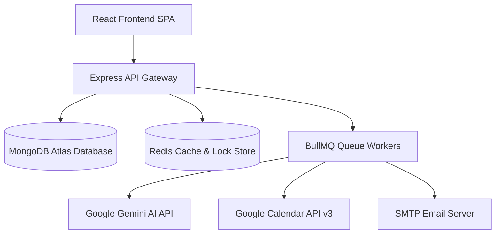

# VibeHealth 🩺

A modern, fault-tolerant healthcare appointment and follow-up management platform supporting **Patient**, **Doctor**, and **Admin** portals with AI-assisted clinical triage, human-in-the-loop post-visit documentation, document-first notification reliability, Google Calendar OAuth 2.0 dual synchronization, and Redis concurrency protection.

---

## 🌐 Live Deployed Application

- **Frontend Application (Vercel):** [https://vibe-health-git-main-soulbladder.vercel.app/](https://vibe-health-git-main-soulbladder.vercel.app/)
- **Backend API Server (Render):** [https://vibehealth.onrender.com](https://vibehealth.onrender.com)
- **API Health Check:** `GET https://vibehealth.onrender.com/api/v1/health`
- **CORS Isolation Test:** `GET https://vibehealth.onrender.com/api/v1/cors-check`

---

## 🌟 Key Features & Architecture Highlights

- **Multi-Role Portals:** Dedicated workflows for Patients (doctor discovery in ₹ INR, on-the-fly availability, slot holds, AI pre-visit intake), Doctors (schedule configuration, leave conflict management, encounter notes, AI review gate), and Admins (system statistics, physician onboarding, notification audit log).
- **Concurrency & Double-Booking Protection:** Temporary slot holds via short-lived Redis (`ioredis`) keys (`SET hold:{doctorId}:{startTime} {patientId} NX EX ttl`), reinforced by MongoDB compound unique index `(doctorId, startTime)` on active appointments. Catches duplicate key error `E11000` and transforms it into a clean HTTP `409 Conflict`.
- **On-The-Fly Slot Engine:** Computes available slots dynamically without pre-generating slot documents. Respects doctor working hours, buffer minutes, existing appointments (`held`/`confirmed`), approved leave days, and past time filtering in the clinic's local timezone (`Asia/Kolkata` IST).
- **Doctor Leave Management with Conflict Protection:** Previews conflicting appointments before saving leave. On confirmation, cancels affected bookings with reason `doctor_unavailable`, notifies patients, and enqueues Google Calendar event deletion.
- **Document-First Visible Notification System:** Every outbound email creates a `Notification` document (`deliveryStatus: 'pending'`) before BullMQ queuing. Tracks 3-attempt exponential backoff retries, persists error logs on 3rd failure, deterministically cancels delayed 24h reminders on appointment cancellation, and provides an Admin Audit Log (`/admin/notifications`) with manual retry control.
- **Google Calendar OAuth 2.0 Dual Sync & Resilience:** Synchronizes calendar events on both patient and doctor Google Calendars using `access_type: 'offline'` and narrowest scope (`https://www.googleapis.com/auth/calendar.events`). Catches `invalid_grant` token revocation errors, flips status to `reauth_required`, clears tokens, and prompts the user to reconnect without crashing or blocking core bookings.
- **Clinical AI Triage & Human-in-the-Loop Gate:** Pre-visit symptom intake generated via Google Gemini API (`gemini-2.5-flash`). Post-visit clinical notes are converted into plain-language patient summaries, locked behind a mandatory physician review and approval gate (`doctorApproved = true`) before patient release.

---

## 🏗️ Technology Stack & System Architecture

### Technology Stack

| Layer | Technology |
|---|---|
| **Frontend** | React 18, Vite, Tailwind CSS, React Router v6, Axios, Lucide Icons |
| **Backend Framework** | Node.js, Express.js (ES Modules) |
| **Database &ODM** | MongoDB with Mongoose (Compound Indexing, Validation) |
| **Cache & Lock Store** | Redis (`ioredis`) |
| **Background Queues** | BullMQ (Redis-backed queues: `email-queue`, `reminder-queue`, `calendar-sync-queue`, `llm-summary-queue`, `slot-hold-queue`) |
| **Authentication** | JWT (JSON Web Tokens), `bcrypt` password hashing, RBAC + Ownership middleware |
| **Input Validation** | Zod schema validation |
| **AI / LLM Integration** | Google Gemini API (`gemini-2.5-flash`) via dedicated service layer |
| **Calendar Sync** | Google Calendar API v3 (OAuth 2.0 with token auto-refresh listener) |
| **Transactional Email** | Nodemailer (SMTP with HTML email rendering) |

### System Architecture Diagram



---

## 🛠️ Local Setup & Installation

### Prerequisites

- **Node.js** (v18+ or v20+)
- **MongoDB** (Local instance or MongoDB Atlas URI)
- **Redis** (Local Redis daemon or Cloud Redis URL)

### 1. Clone Repository & Install Dependencies

```bash
git clone https://github.com/Kshitij-pro69/VibeHealth.git
cd VibeHealth

# Install backend dependencies
cd server
npm install

# Install frontend dependencies
cd ../client
npm install
```

### 2. Configure Environment Variables

Create `.env` inside the `server/` directory (or use `.env.example` as a template):

```bash
cp .env.example server/.env
```

### 3. Seed Database & Start Development Servers

```bash
# Seed initial test data (Admin, Doctors, Patients)
cd server
npm run seed

# Start backend server (runs on http://localhost:5000)
npm run dev

# In a separate terminal, start frontend dev server (runs on http://localhost:5173)
cd ../client
npm run dev
```

---

## 🔑 Environment Variables Walkthrough (`.env.example`)

| Variable | Description | Example / Default |
|---|---|---|
| `PORT` | HTTP port for the Express API server | `5000` |
| `NODE_ENV` | Application environment (`development` or `production`) | `development` |
| `SERVER_URL` | Base URL of backend server | `http://localhost:5000` |
| `CLIENT_URL` | Base URL of frontend SPA (used for CORS and OAuth redirects) | `http://localhost:5173` |
| `MONGO_URI` | MongoDB connection URI (local or MongoDB Atlas) | `mongodb://localhost:27017/vibehealth` |
| `REDIS_URL` | Redis connection URL for slot holds and BullMQ | `redis://localhost:6379` |
| `JWT_SECRET` | Secret key for signing JSON Web Tokens | `vibehealth_jwt_secret_change_in_prod` |
| `JWT_EXPIRES_IN` | Token validity duration | `7d` |
| `GEMINI_API_KEY` | API Key for Google Gemini API from Google AI Studio | `AIzaSy...` |
| `LLM_MODEL` | Gemini model name | `gemini-2.5-flash` |
| `GOOGLE_CLIENT_ID` | OAuth 2.0 Client ID from Google Cloud Console | `xxx.apps.googleusercontent.com` |
| `GOOGLE_CLIENT_SECRET` | OAuth 2.0 Client Secret from Google Cloud Console | `GOCSPX-xxx` |
| `GOOGLE_REDIRECT_URI` | Authorized OAuth 2.0 redirect callback URL | `http://localhost:5000/api/v1/auth/google/callback` |
| `EMAIL_HOST` | SMTP server hostname | `smtp.gmail.com` |
| `EMAIL_PORT` | SMTP server port | `587` |
| `EMAIL_SECURE` | Set to `true` for port 465, `false` for port 587 | `false` |
| `EMAIL_USER` | SMTP authentication username / email | `your_email@gmail.com` |
| `EMAIL_PASS` | SMTP authentication password or App Password | `your_app_password` |
| `EMAIL_FROM` | Sender display name and email address | `"VibeHealth <no-reply@vibehealth.com>"` |
| `SLOT_HOLD_TTL_SECONDS` | Duration (seconds) a slot hold key remains active in Redis | `300` |

---

## 📅 Google Calendar OAuth 2.0 Setup Guide

To enable Google Calendar synchronization:

1. **Create a Google Cloud Project:**
   - Go to [Google Cloud Console](https://console.cloud.google.com/).
   - Create a new project named **VibeHealth**.

2. **Enable Google Calendar API:**
   - Navigate to **APIs & Services > Library**.
   - Search for **Google Calendar API** and click **Enable**.

3. **Configure OAuth Consent Screen:**
   - Navigate to **APIs & Services > OAuth consent screen**.
   - Select User Type **External**.
   - Fill in App Name (*VibeHealth*), User Support Email, and Developer Contact Email.
   - **CRITICAL REQUIREMENT:** Set Publishing Status to **"In production"**.
     > [!IMPORTANT]
     > Google OAuth refresh tokens issued for apps in "Testing" mode expire after 7 days, forcing re-authentication. Setting publishing status to "In production" ensures long-lived refresh tokens.
   - Add scope: `https://www.googleapis.com/auth/calendar.events` (narrowest required scope).

4. **Create OAuth 2.0 Credentials:**
   - Navigate to **APIs & Services > Credentials > Create Credentials > OAuth Client ID**.
   - Application type: **Web application**.
   - **Authorized JavaScript Origins:**
     - `http://localhost:5173`
     - `https://vibe-health-git-main-soulbladder.vercel.app`
   - **Authorized Redirect URIs:**
     - `http://localhost:5000/api/v1/auth/google/callback`
     - `https://vibehealth.onrender.com/api/v1/auth/google/callback`

5. **Copy Credentials to `.env`:**
   - Copy Client ID and Client Secret into `GOOGLE_CLIENT_ID` and `GOOGLE_CLIENT_SECRET`.

> [!NOTE]
> During development or before Google verification, users will see the standard *"Google haven't verified this app"* warning screen. Click **Advanced > Proceed to VibeHealth (unsafe)** to complete authorization.

---

## 🤖 LLM Prompts & Clinical Safety Architecture

### 1. Pre-Visit Triage Summary Prompt

Executed asynchronously on booking confirmation via `GeminiService.generatePreVisitSummary`:

```text
You are a clinical reference triage assistant. Analyze the patient symptom intake data below and produce a structured clinician-reference summary.

Patient Symptom Intake:
- Primary Symptoms: {symptoms}
- Symptom Duration: {duration}
- Pain/Severity Level: {severity}/10
- Existing Medical Conditions: {existingConditions}
- Current Medications: {currentMedications}

CRITICAL RULES:
1. Do NOT provide direct medical advice or diagnoses.
2. Label output explicitly as Clinician-Reference Triage Assistance.
3. Respond ONLY with a valid JSON object matching this exact schema:
{
  "urgency": "Low" | "Medium" | "High",
  "chiefComplaint": "Concise 1-2 sentence summary of symptoms",
  "suggestedQuestions": ["Question 1 for doctor to ask", "Question 2", "Question 3"]
}
4. Do NOT wrap output in markdown code blocks or add preambles.
```

### 2. Post-Visit Patient Summary Prompt

Executed asynchronously on post-visit note submission via `GeminiService.generatePatientSummary`:

```text
You are a medical communication assistant. Rephrase the attending doctor's clinical encounter notes and prescriptions into a clear, patient-friendly summary.

Attending Physician Encounter Notes:
{clinicalNotes}

Prescriptions Issued:
{prescriptionsList}

CRITICAL CONSTRAINTS:
1. Rephrase ONLY what the doctor wrote.
2. STABLE CONSTRAINT: NEVER add conditions, medical advice, diagnoses, dosages, or recommendations that the doctor did not explicitly write.
3. Respond ONLY with a valid JSON object matching this schema:
{
  "patientSummary": "Plain-language narrative explanation for the patient",
  "medicationSchedule": [
    { "medicine": "Name", "dosage": "Dosage", "frequency": "Frequency", "duration": "Duration" }
  ],
  "followUpSteps": ["Step 1", "Step 2"]
}
```

### 3. Failure Handling & Human-in-the-Loop Strategy

- **20-Second Timeout:** Gemini requests carry an explicit 20-second timeout.
- **Strict Schema Validation:** Parsed responses are validated against Zod schemas (`urgency` strictly `'Low' | 'Medium' | 'High'`, `suggestedQuestions` array of 3 strings). Validation failures throw and mark the job failed.
- **Non-Blocking AI Pipeline:** AI failure (`patientSummaryStatus = 'failed'`) **NEVER** cancels or blocks an appointment.
- **Human-in-the-Loop Review Gate:** AI-generated post-visit summaries are stored as draft (`patientSummaryStatus = 'pending' -> 'completed'`). Nothing reaches the patient until the doctor explicitly reviews, edits, and clicks **"Approve & Release to Patient"** (`doctorApproved = true`). If AI fails, the doctor can write the summary manually and approve it without LLM dependency.

---

## 📖 Complete API Reference

All endpoints are prefixed with `/api/v1` (or `/api`).

### Auth & User Endpoints

| Method | Endpoint | Auth / Role | Description | Payload / Query |
|---|---|---|---|---|
| `POST` | `/api/v1/auth/register` | Public | Register new Patient or Doctor | `{ name, email, password, role, phone }` |
| `POST` | `/api/v1/auth/login` | Public | User authentication | `{ email, password }` |
| `GET` | `/api/v1/auth/me` | Authenticated | Get logged-in user profile & doctor details | Header: `Authorization: Bearer <token>` |
| `GET` | `/api/v1/auth/google` | Authenticated | Initiate Google OAuth 2.0 consent redirect | Query: `token=<jwt>` (optional) |
| `GET` | `/api/v1/auth/google/callback` | Public | OAuth redirect handler | Query: `code`, `state` |
| `GET` | `/api/v1/auth/calendar-status` | Authenticated | Get user's Google Calendar status | Returns `{ calendarStatus }` |
| `POST` | `/api/v1/auth/disconnect-calendar` | Authenticated | Disconnect Google Calendar & clear tokens | None |

### Doctor & Availability Endpoints

| Method | Endpoint | Auth / Role | Description | Payload / Query |
|---|---|---|---|---|
| `GET` | `/api/v1/doctors` | Public | List active doctors | Query: `specialty`, `search` |
| `GET` | `/api/v1/doctors/:id/profile` | Public | Get single doctor profile | Path: `id` |
| `GET` | `/api/v1/doctors/:doctorId/availability` | Public | Compute available slots on the fly | Query: `date=YYYY-MM-DD`, `tz=Asia/Kolkata` |
| `PUT` | `/api/v1/doctors/profile` | Doctor | Update schedule & consultation fee | `{ workingHours, consultationFee, specialty }` |
| `GET` | `/api/v1/doctors/leave` | Doctor / Admin | List doctor time off records | None |
| `POST` | `/api/v1/doctors/leave/preview` | Doctor / Admin | Preview conflicting appointments | `{ startDate, endDate }` |
| `POST` | `/api/v1/doctors/leave` | Doctor / Admin | Request leave & resolve conflicts | `{ startDate, endDate, reason, confirmCancelBookings }` |
| `DELETE` | `/api/v1/doctors/leave/:id` | Doctor / Admin | Delete leave record | Path: `id` |

### Appointment Endpoints

| Method | Endpoint | Auth / Role | Description | Payload / Query |
|---|---|---|---|---|
| `POST` | `/api/v1/appointments/hold` | Patient | Acquire Redis lock & create `held` appointment | `{ doctorId, startTime, endTime }` |
| `POST` | `/api/v1/appointments/:id/confirm` | Patient | Attach symptoms & confirm booking | `{ reasonForVisit, symptoms, duration, severity }` |
| `GET` | `/api/v1/appointments/my-appointments` | Authenticated | Get user appointments list | Query: `status` |
| `POST` | `/api/v1/appointments/:id/cancel` | Patient / Doctor | Cancel appointment & cancel 24h reminder | Path: `id` |
| `POST` | `/api/v1/appointments/:id/post-visit` | Doctor | Save clinical notes & trigger AI summary draft | `{ clinicalNotes, prescriptions }` |
| `POST` | `/api/v1/appointments/:id/post-visit/approve` | Doctor | Approve patient summary (Human-in-Loop) | `{ approvedText }` |
| `POST` | `/api/v1/appointments/:id/post-visit/retry` | Doctor | Retry failed AI post-visit job | Path: `id` |

### Admin & Utility Endpoints

| Method | Endpoint | Auth / Role | Description | Payload / Query |
|---|---|---|---|---|
| `GET` | `/api/v1/admin/stats` | Admin | Get platform metrics & counts | None |
| `GET` | `/api/v1/admin/users` | Admin | List all registered users | Query: `role`, `search` |
| `POST` | `/api/v1/admin/doctors` | Admin | Create doctor profile with credentials email | `{ name, email, specialty, fee }` |
| `GET` | `/api/v1/admin/notifications` | Admin | Notification delivery audit logs | Query: `deliveryStatus`, `emailType`, `search` |
| `POST` | `/api/v1/admin/notifications/:id/retry` | Admin | Manual retry of failed notification | Path: `id` |
| `GET` | `/api/v1/health` | Public | System health check (MongoDB & Redis status) | None |
| `GET` | `/api/v1/cors-check` | Public | CORS connectivity check | Returns `{ ok: true }` |

---

## 🗄️ Database Schemas & Entity Relationships

```
+-------------------+        1:1        +-----------------------+
|       User        | ----------------> |     DoctorProfile     |
+-------------------+                   +-----------------------+
| _id (PK)          |                   | _id (PK)              |
| name, email       |                   | userId (FK -> User)   |
| password, role    |                   | specialty             |
| calendarStatus    |                   | consultationFee (₹)   |
| googleTokens      |                   | workingHours []       |
+-------------------+                   +-----------------------+
        |                                           |
        | 1:N                                       | 1:N
        v                                           v
+---------------------------------------------------------------+
|                          Appointment                          |
+---------------------------------------------------------------+
| _id (PK)                                                      |
| patientId (FK -> User)                                        |
| doctorId (FK -> User)                                         |
| startTime, endTime (UTC Dates)                                |
| status: 'held' | 'confirmed' | 'cancelled' | 'completed'       |
| preVisitSummary: { urgency, chiefComplaint, suggestedQ }      |
| postVisitSummary: { clinicalNotes, prescriptions, approved }  |
| patientCalendarEventId, doctorCalendarEventId                 |
| reminderJobId                                                 |
+---------------------------------------------------------------+
```

---

## ⚠️ Clinical Safety & Privacy Disclaimer

> [!CAUTION]
> **Clinical AI Safety Disclaimer:** AI-generated outputs (pre-visit symptom triage and post-visit summaries) are strictly **clinician-assistive tools** designed for administrative and reference support. They do **NOT** constitute authoritative medical advice, diagnosis, or treatment plans. Patients experiencing medical emergencies should contact emergency services immediately.

> [!WARNING]
> **Data Privacy Notice:** This application uses free-tier external LLM APIs (Google Gemini API). **No real patient Protected Health Information (PHI) or personally identifiable health data should be entered into this application.**

---

## 📄 License & Credits

Developed as part of the VibeHealth Healthcare Management Platform. Built using Node.js, Express, React, Vite, MongoDB, Redis, BullMQ, and Google Gemini API.
